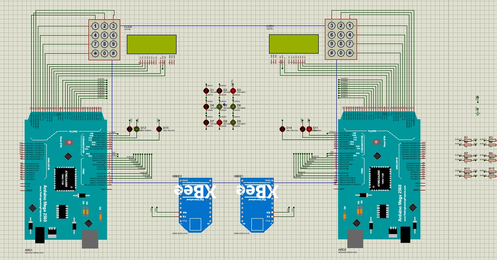

# Arduino Tic-Tac-Toe

This project is implementation of tic-tac-teo game on Arduino board.
This game is multi-player and must be run on two seperated boards.
The two boards can communicate with each other by XBee module from serial I/O.
The simulation of the game is implemeted in Proteus application.

Here is a screenshot of the simulation environment:

# Choose players

Using pin number 21, you can choose your player mode. If you set this pin
in HIGH voltage, you will be the beginner and X player. By setting this pin
to LOW voltage, you will be O player.
